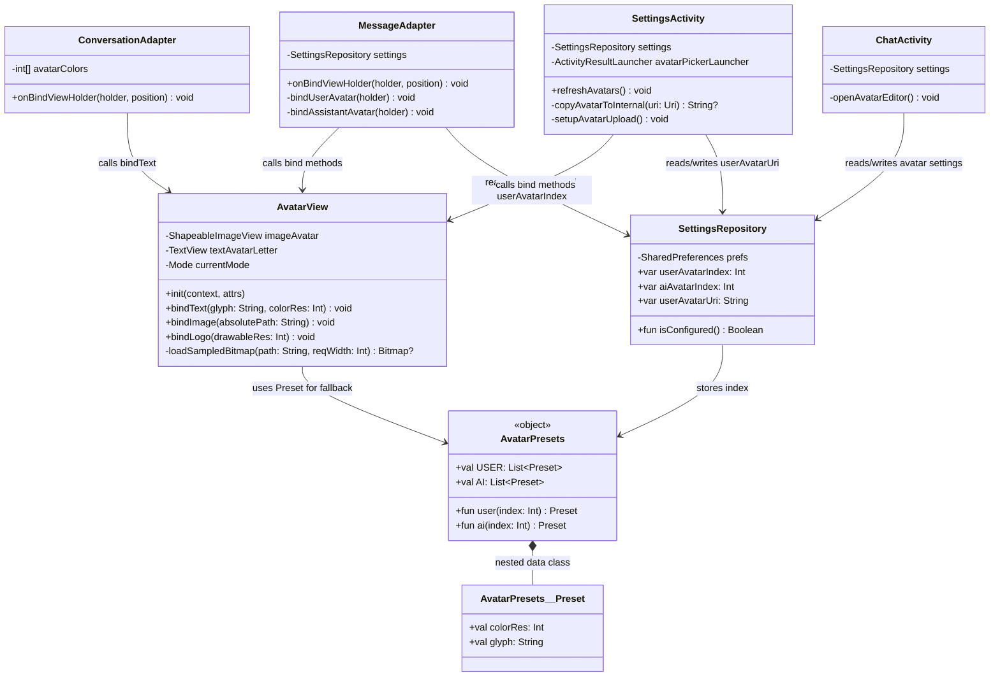
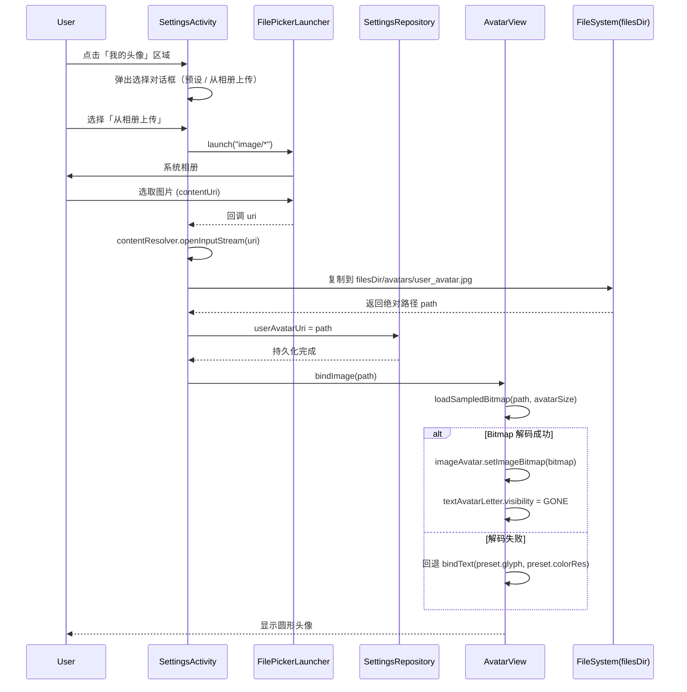
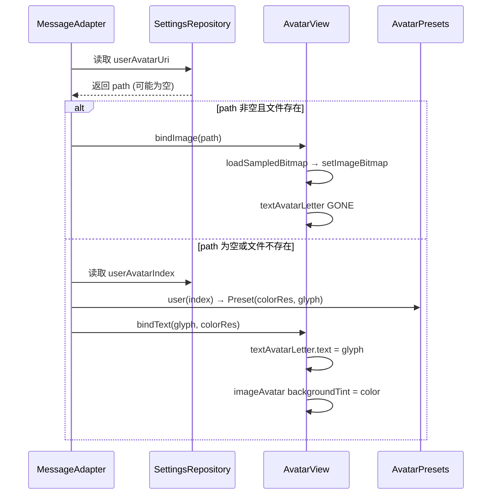
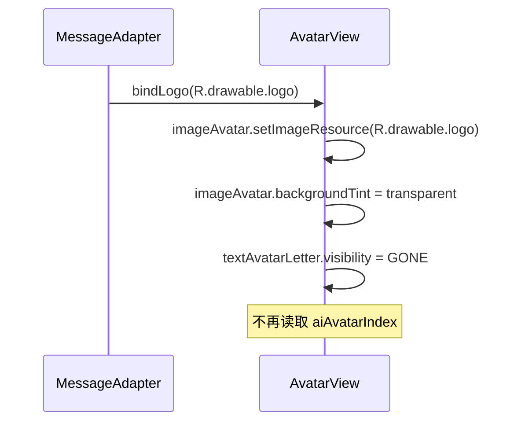
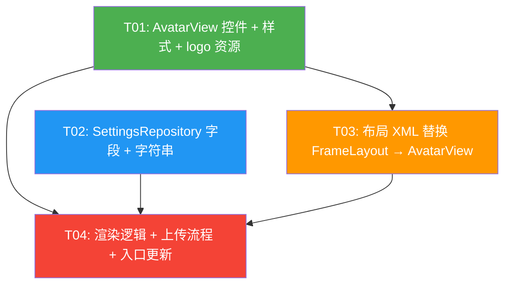

# Hermes Avatar Incremental Architecture Design

> 架构师：高见远（Gao） | 项目：Hermes Chat Android | 日期：2025-07-12
> 基于增量 PRD：修复头像文字溢出 + 用户自定义图片头像 + 助手头像固定 logo

---

## Part A: System Design

### 1. Implementation Approach

#### 1.1 Core Technical Challenges

| # | 挑战 | 分析 |
|---|------|------|
| C1 | **文字/emoji 溢出圆形** | 当前所有头像用 `FrameLayout + ImageView(圆形背景) + TextView(match_parent)` 三层叠加，FrameLayout 未设 `clipToOutline`，TextView `match_parent` 导致文字不受圆形约束溢出。emoji 尤其严重（字形宽度 > 字母）。 |
| C2 | **统一圆形裁剪方案** | 需在不引入 Glide 的前提下，用原生方案实现「图片圆形裁剪 + 文字圆形背景」统一表现。Material `ShapeableImageView` + `shapeAppearanceOverlay` 是最优选——已在依赖 `material:1.13.0` 中，零新增依赖。 |
| C3 | **图片模式与文字模式共存** | 同一个头像位置需要支持三种渲染：预设文字/emoji、自定义图片、固定 logo drawable。需抽象为统一控件。 |
| C4 | **自定义图片持久化与加载** | Content URI 在重启后可能失效（权限撤销），须复制到应用私有目录存绝对路径。加载时需采样防 OOM，加载失败须回退预设。 |
| C5 | **助手头像固定 logo** | 助手气泡和设置页 Hermes 预览不再读 `aiAvatarIndex`，固定 `R.drawable.logo`。需确保 logo.png 正确放入 `drawable-nodpi/`。 |

#### 1.2 Framework & Library Selections

| 选型 | 理由 |
|------|------|
| `ShapeableImageView` (Material 1.13.0) | 已在依赖中，原生支持 `shapeAppearanceOverlay` 圆形裁剪，无需引入第三方库。替代当前 `ImageView + bg_circle_blue` 方案。 |
| `ActivityResultContracts.GetContent()` (activity-ktx 1.9.2) | 已在依赖中，用于从相册选取图片。ChatActivity 已有 `filePickerLauncher` 范例。 |
| `BitmapFactory` + `inSampleSize` | 不引入 Glide，用原生 BitmapFactory 解码本地图片文件，通过采样防止 OOM。 |
| 自定义 `AvatarView` 组合控件 | 封装「ShapeableImageView + TextView」为一个可复用控件，对外暴露 `bindText()` / `bindImage()` / `bindLogo()` 三个入口，统一替换当前 5 处 FrameLayout 用法。 |

#### 1.3 Architecture Pattern

保持现有 MVVM 不变，本次改动集中在 **View 层**：

```
AvatarView (自定义组合控件)
  ├── ShapeableImageView  — 圆形裁剪的图片层（图片模式 / logo 模式）
  └── TextView            — 文字层（文字模式；图片模式时隐藏）
```

- **AvatarView** 负责模式切换与渲染逻辑，Adapter/Activity 只需调用对应 bind 方法。
- **SettingsRepository** 新增 `userAvatarUri` 字段，持久化自定义头像绝对路径。
- **AvatarPresets** 保持不变（仍用于文字模式回退和会话列表）。

---

### 2. File List

#### 新建文件

| # | 相对路径 | 说明 |
|---|---------|------|
| N1 | `app/src/main/java/com/hermes/chat/ui/common/AvatarView.kt` | 可复用圆形头像组合控件，封装 ShapeableImageView + TextView，支持 TEXT/IMAGE/LOGO 三种模式 |
| N2 | `app/src/main/res/drawable-nodpi/logo.png` | 从项目根目录 `logo.png` 复制，用于助手头像 `R.drawable.logo` |

#### 修改文件

| # | 相对路径 | 说明 |
|---|---------|------|
| M1 | `app/src/main/res/values/themes.xml` | 新增 `ShapeAppearance.Hermes.Circle` 圆形 shapeAppearanceOverlay 样式 |
| M2 | `app/src/main/java/com/hermes/chat/data/preferences/SettingsRepository.kt` | 新增 `userAvatarUri`(String) 字段 + KEY_USER_AVATAR_URI 常量 |
| M3 | `app/src/main/res/layout/item_message_user.xml` | FrameLayout+ImageView+TextView 三层 → 单个 `<AvatarView>`，修复溢出 |
| M4 | `app/src/main/res/layout/item_message_assistant.xml` | 同上，助手气泡头像改用 AvatarView |
| M5 | `app/src/main/res/layout/item_conversation.xml` | 同上，会话列表头像改用 AvatarView（仅修复溢出，不接自定义图片） |
| M6 | `app/src/main/res/layout/activity_settings.xml` | 资料区 + 我的头像 + Hermes 头像三处 FrameLayout → AvatarView；用户头像区增加「从相册上传」入口 |
| M7 | `app/src/main/java/com/hermes/chat/ui/chat/MessageAdapter.kt` | UserVH 改为读 `userAvatarUri` 优先图片、回退预设；AssistantVH 固定 `bindLogo()` |
| M8 | `app/src/main/java/com/hermes/chat/ui/conversations/ConversationAdapter.kt` | 绑定改为 `avatarView.bindText()`，修复溢出 |
| M9 | `app/src/main/java/com/hermes/chat/ui/settings/SettingsActivity.kt` | 新增图片选取→复制私有目录→存路径流程；`refreshAvatars()` 支持图片模式；Hermes 预览固定 logo |
| M10 | `app/src/main/java/com/hermes/chat/ui/chat/ChatActivity.kt` | `openAvatarEditor()` 中 USER 角色增加「从相册上传」选项；助手角色入口移除或禁用 |
| M11 | `app/src/main/res/values/strings.xml` | 新增 `avatar_upload`（从相册上传）、`avatar_upload_success` 等字符串 |

---

### 3. Data Structures and Interfaces

#### 3.1 Class Diagram



#### 3.2 Key Interface Details

**AvatarView** — 公开 API：

```kotlin
class AvatarView @JvmOverloads constructor(
    context: Context,
    attrs: AttributeSet? = null,
    defStyleAttr: Int = 0
) : FrameLayout(context, attrs, defStyleAttr) {

    private enum class Mode { TEXT, IMAGE, LOGO }

    private val imageAvatar: ShapeableImageView   // 圆形裁剪图片层
    private val textAvatarLetter: TextView         // 文字层（居中）
    private var currentMode: Mode = Mode.TEXT

    /** 文字/emoji 模式：设置圆形底色 + 居中文字 */
    fun bindText(glyph: String, colorRes: Int)

    /** 自定义图片模式：从绝对路径加载（带采样防 OOM），失败回退到 bindText */
    fun bindImage(absolutePath: String)

    /** 固定 logo 模式：设置 drawable 资源（如 R.drawable.logo） */
    fun bindLogo(drawableRes: Int)

    /** 内部：采样加载本地图片，返回 Bitmap 或 null */
    private fun loadSampledBitmap(path: String, reqWidth: Int): Bitmap?
}
```

**SettingsRepository** — 新增字段：

```kotlin
/** 用户自定义头像绝对路径（空字符串表示未设置，使用预设） */
var userAvatarUri: String
    get() = prefs.getString(KEY_USER_AVATAR_URI, "") ?: ""
    set(v) = prefs.edit().putString(KEY_USER_AVATAR_URI, v).apply()

companion object {
    // ... existing keys ...
    private const val KEY_USER_AVATAR_URI = "user_avatar_uri"
}
```

**AvatarPresets** — 不调整。`USER` / `AI` 数组保持原样，仍用于：
- 用户头像文字模式回退（当 `userAvatarUri` 为空时）
- 会话列表头像（始终用文字模式）
- 助手头像不再读取 AI 预设（固定 logo），但 AI 数组保留不删（避免破坏其他可能引用）

---

### 4. Program Call Flow

#### 4.1 用户在设置页上传自定义头像



#### 4.2 聊天页渲染用户头像



#### 4.3 助手头像固定 logo



---

### 5. Anything UNCLEAR

| # | 待明确事项 | 当前假设 |
|---|-----------|---------|
| U1 | 设置页「我的头像」点击后的交互：是直接弹出预设选择器（底部增加「从相册上传」按钮），还是先弹出「预设 / 上传」二选一菜单？ | **假设**：改造现有 `showAvatarPicker` 对话框，底部增加「从相册上传」按钮，点击后触发 `GetContent("image/*")`。 |
| U2 | 用户上传自定义头像后，是否仍允许切回预设头像？ | **假设**：是。选择预设时将 `userAvatarUri` 清空为 `""`，恢复文字模式。 |
| U3 | `ChatActivity.openAvatarEditor()` 中助手角色入口是否移除？ | **假设**：保留角色选择器，但选择 AI 后不再弹预设选择器，而是 Toast 提示「Hermes 头像已固定为 logo」。或直接从角色选择器中移除 AI 选项。**建议移除 AI 选项**，只保留「我的头像」入口。 |
| U4 | 资料区头像（56dp）是否也需要支持自定义图片？ | **假设**：是。资料区头像与「我的头像」共用同一数据源（`userAvatarUri` + `userAvatarIndex`），设置页打开时同步渲染。 |
| U5 | logo.png 原始尺寸约 1.3MB，放入 `drawable-nodpi` 后是否需要压缩？ | **假设**：`drawable-nodpi` 表示不按密度缩放，`ShapeableImageView` 会按 view 尺寸缩放显示。但 1.3MB 的 PNG 解码可能占用较多内存。**建议**工程师评估，必要时用工具压缩至 < 200KB 后再放入。 |

---

## Part B: Task Decomposition

### 6. Required Packages

**无需新增任何第三方依赖。** 所需能力均已包含在现有依赖中：

| 能力 | 依赖 | 状态 |
|------|------|------|
| `ShapeableImageView` + `shapeAppearanceOverlay` | `com.google.android.material:material:1.13.0` | ✅ 已有 |
| `ActivityResultContracts.GetContent()` | `androidx.activity:activity-ktx:1.9.2` | ✅ 已有 |
| `BitmapFactory` 采样解码 | Android SDK 原生 | ✅ 无需依赖 |
| ViewBinding | 已启用 | ✅ 已有 |

---

### 7. Task List (ordered by dependency)

#### T01: AvatarView 组合控件 + 圆形样式资源 + logo 资源准备

| 属性 | 值 |
|------|-----|
| **Task ID** | T01 |
| **Task Name** | 基础设施：AvatarView 控件 + 样式资源 + logo.png |
| **Source Files** | `app/src/main/java/com/hermes/chat/ui/common/AvatarView.kt`（新建）<br>`app/src/main/res/values/themes.xml`（修改：新增 ShapeAppearance.Hermes.Circle）<br>`app/src/main/res/drawable-nodpi/logo.png`（新建：从根目录复制）<br>`app/src/main/res/values/dimens.xml`（修改：如需新增 avatar_settings_size 等常量） |
| **Dependencies** | 无 |
| **Priority** | P0 |
| **Description** | 1. 创建 `AvatarView` 继承 `FrameLayout`，内部组合 `ShapeableImageView`（应用 `ShapeAppearance.Hermes.Circle` overlay）+ `TextView`。实现 `bindText(glyph, colorRes)` / `bindImage(absolutePath)` / `bindLogo(drawableRes)` 三个公开方法，以及私有 `loadSampledBitmap()` 采样解码。2. 在 `themes.xml` 新增 `<style name="ShapeAppearance.Hermes.Circle">` 圆形 overlay。3. 将根目录 `logo.png` 复制到 `drawable-nodpi/logo.png`。4. AvatarView 需支持在 XML 中声明使用（`layout_width` / `layout_height` 透传），文字大小通过 XML attribute 或代码设置。 |

#### T02: 数据层 — SettingsRepository 新增字段 + 字符串资源

| 属性 | 值 |
|------|-----|
| **Task ID** | T02 |
| **Task Name** | SettingsRepository userAvatarUri 字段 + strings.xml |
| **Source Files** | `app/src/main/java/com/hermes/chat/data/preferences/SettingsRepository.kt`（修改）<br>`app/src/main/res/values/strings.xml`（修改）<br>`app/src/main/java/com/hermes/chat/ui/common/AvatarPresets.kt`（修改：仅加注释说明 AI 预设不再用于助手气泡） |
| **Dependencies** | 无（可与 T01 并行） |
| **Priority** | P0 |
| **Description** | 1. `SettingsRepository` 新增 `var userAvatarUri: String` 属性 + `KEY_USER_AVATAR_URI = "user_avatar_uri"` 常量，getter 默认返回 `""`。2. `strings.xml` 新增：`avatar_upload`（"从相册上传"）、`avatar_upload_success`（"头像已更新"）、`avatar_upload_failed`（"图片加载失败，已使用默认头像"）、`avatar_ai_fixed`（"Hermes 头像已固定"）等。3. `AvatarPresets` 在 `AI` 数组上方加注释说明「助手气泡已固定使用 R.drawable.logo，此数组仅保留兼容」。 |

#### T03: 布局层 — 4 个 XML 替换 FrameLayout 为 AvatarView

| 属性 | 值 |
|------|-----|
| **Task ID** | T03 |
| **Task Name** | 布局 XML：FrameLayout → AvatarView 替换 |
| **Source Files** | `app/src/main/res/layout/item_message_user.xml`（修改）<br>`app/src/main/res/layout/item_message_assistant.xml`（修改）<br>`app/src/main/res/layout/item_conversation.xml`（修改）<br>`app/src/main/res/layout/activity_settings.xml`（修改：资料区 + 我的头像 + Hermes 头像三处） |
| **Dependencies** | T01（需要 AvatarView 类存在才能在 XML 中引用） |
| **Priority** | P0 |
| **Description** | 1. `item_message_user.xml`：将 L51-71 的 `FrameLayout + ImageView + TextView` 替换为单个 `<com.hermes.chat.ui.common.AvatarView>`，尺寸保持 `@dimen/avatar_chat_size`（30dp），保留 `layout_gravity="bottom"`。2. `item_message_assistant.xml`：将 L13-34 同样替换为 AvatarView。3. `item_conversation.xml`：将 L22-57 替换为 AvatarView（保留未读红点 TextView 作为 AvatarView 的 sibling，不移入 AvatarView 内部）。4. `activity_settings.xml`：资料区（L51-70）、我的头像（L128-147）、Hermes 头像（L200-219）三处 FrameLayout 替换为 AvatarView，给每处加 `android:id`（如 `@+id/avatarProfile`、`@+id/avatarUser`、`@+id/avatarAi`）。5. 所有 AvatarView 在 XML 中使用 `app:strokeWidth="0dp"` 避免默认描边。 |

#### T04: 逻辑层 — Adapter 渲染 + 设置页上传 + 聊天页入口

| 属性 | 值 |
|------|-----|
| **Task ID** | T04 |
| **Task Name** | 渲染逻辑 + 图片上传流程 + 头像编辑入口 |
| **Source Files** | `app/src/main/java/com/hermes/chat/ui/chat/MessageAdapter.kt`（修改）<br>`app/src/main/java/com/hermes/chat/ui/conversations/ConversationAdapter.kt`（修改）<br>`app/src/main/java/com/hermes/chat/ui/settings/SettingsActivity.kt`（修改）<br>`app/src/main/java/com/hermes/chat/ui/chat/ChatActivity.kt`（修改）<br>`app/src/main/java/com/hermes/chat/ui/common/AvatarPicker.kt`（修改：showAvatarPicker 底部增加上传按钮） |
| **Dependencies** | T01（AvatarView）、T02（SettingsRepository 字段）、T03（布局已引用 AvatarView） |
| **Priority** | P0 |
| **Description** | 1. **MessageAdapter**：UserVH 的 `onBindViewHolder` 改为读 `settings.userAvatarUri`，非空则 `binding.avatarView.bindImage(path)`，空则 `bindText(preset.glyph, preset.colorRes)`；AssistantVH 改为 `binding.avatarView.bindLogo(R.drawable.logo)`，不再读 `aiAvatarIndex`。2. **ConversationAdapter**：绑定改为 `binding.avatarView.bindText(letter, colorRes)`。3. **SettingsActivity**：新增 `avatarPickerLauncher`（`GetContent("image/*")`），回调中用 `contentResolver.openInputStream` 复制到 `filesDir/avatars/user_avatar.jpg`，存路径到 `settings.userAvatarUri`，调 `refreshAvatars()` 刷新。`refreshAvatars()` 改为：用户头像有 uri 则 `bindImage`，否则 `bindText`；Hermes 头像固定 `bindLogo(R.drawable.logo)`。4. **ChatActivity**：`openAvatarEditor()` 中选择 USER 后，弹出的 `showAvatarPicker` 底部增加「从相册上传」按钮，点击触发 `avatarPickerLauncher.launch("image/*")`（复用 SettingsActivity 的复制逻辑或提取为工具函数）；选择 AI 后 Toast 提示已固定。5. **AvatarPicker.kt**：`showAvatarPicker` 函数签名增加可选回调 `onUpload: (() -> Unit)?`，对话框底部增加「从相册上传」按钮。 |

---

### 8. Shared Knowledge (Cross-File Conventions)

```
# 头像模式优先级
- 用户头像：userAvatarUri 非空且文件存在 → IMAGE 模式；否则 → TEXT 模式（读 userAvatarIndex 预设）
- 助手头像：始终 LOGO 模式（R.drawable.logo），不再读 aiAvatarIndex
- 会话列表头像：始终 TEXT 模式（首字母 + hash 取色），不接自定义图片

# 自定义头像存储约定
- 路径：context.filesDir/avatars/user_avatar.jpg
- 存储值：绝对路径字符串（非 Content URI），空字符串表示未设置
- 文件名固定 user_avatar.jpg（每次上传覆盖旧文件）
- 切回预设时：settings.userAvatarUri = ""（不删文件，下次上传覆盖）

# 圆形裁剪约定
- 所有头像统一用 ShapeableImageView + ShapeAppearance.Hermes.Circle
- 不再使用 bg_circle_blue.xml / avatar_circle.xml 作为头像背景
- AvatarView 内部 ImageView 的 backgroundTint 由 bindText 设置底色，bindImage/bindLogo 时清除

# 图片加载约定
- 不引入 Glide
- 自定义图片用 BitmapFactory + inSampleSize 采样加载，目标尺寸 = AvatarView 实际宽高
- 加载失败（文件不存在/解码异常）自动回退到 TEXT 模式预设

# 尺寸常量（已有，保持不变）
- avatar_chat_size = 30dp（聊天气泡）
- avatar_list_size = 48dp（会话列表）
- 设置页：资料区 56dp、头像选择项 44dp（硬编码在 XML 中）

# logo 资源
- R.drawable.logo → drawable-nodpi/logo.png
- R.drawable.ic_logo_large → drawable-nodpi/ic_logo_large.png（已有，不改动）
```

---

### 9. Task Dependency Graph



**执行顺序建议**：
1. T01 + T02 可并行（无相互依赖）
2. T03 依赖 T01 完成后开始
3. T04 依赖 T01 + T02 + T03 全部完成后开始（最终集成）
